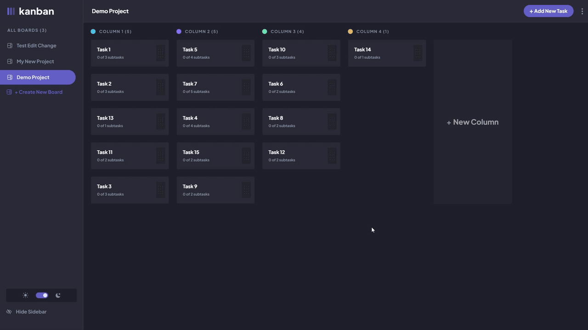

# Kanban - Project Management Tool

My web app implementation of a Kanban board. The app supports CRUD operations for boards and tasks as well as using drag and drop to organize tasks by priority and status.

## Table of contents

-   [Overview](#overview)
    -   [Links](#links)
-   [My process](#my-process)
    -   [Built with](#built-with)
    -   [What I learned](#what-i-learned)
    -   [Continued development](#continued-development)
-   [Author](#author)

### Links

-   Live Site URL: [https://jordan-kisiel-kanban.vercel.app](https://jordan-kisiel-kanban.vercel.app)
-   Detailed Breakdown: [https://jordankisiel.com/kanban-breakdown](https://jordankisiel.com/kanban-breakdown)

### Built with

-   Mobile-first workflow
-   [Next.js](https://nextjs.org/) - Fullstack React Framework
-   [Tailwindcss](https://tailwindcss.com/) - CSS framework
-   [TypeScript](https://www.typescriptlang.org/) - Language
-   [Prisma](https://www.prisma.io/) - ORM
-   [Postgresql](https://www.postgresql.org/) - Database
-   [dndkit](https://dndkit.com/) - Drag and Drop
-   [Tanstack Query](https://tanstack.com/query/latest) - Data Management
-   [NextAuth](https://next-auth.js.org/) - Auth

### What I learned

This was the my first project that utilized a database. As a result, I learned about querying the database, creating and migrating data models, and managing the retrieved data. I solidified my knowledge of CRUD operations and figured out how to deal with operations that require multiple CRUD operations in the same transaction. Additionally, I learned how to implement optimistic updates. This project was also my introduction to the concepts behind auth as well as drag and drop interfaces.

### Continued development

For future projects with Auth I'd like to explore adding a custom login option rather than relying on OAuth providers only as well as providing more access control options. I'd also be interested in exploring using CRDT data structures to provide a better drag and drop experience rather than waiting for data to sync before allowing the user to drag again.

## Author

-   Website - [Jordan Kisiel](https://jordankisiel.com)
-   Linkedin - [Jordan Kisiel](https://www.linkedin.com/in/jordan-kisiel-b60129114)
-   Twitter - [@JordanKisiel](https://www.twitter.com/JordanKisiel)
